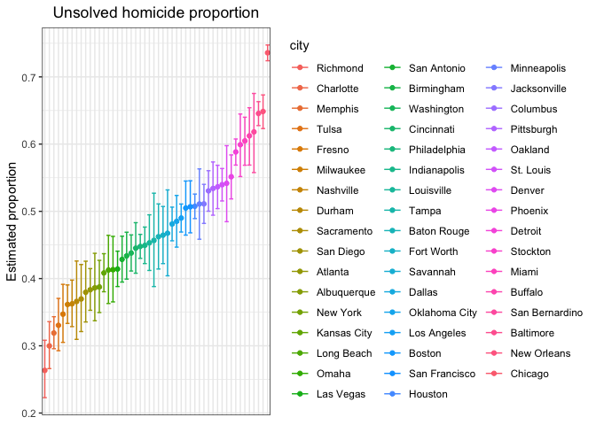
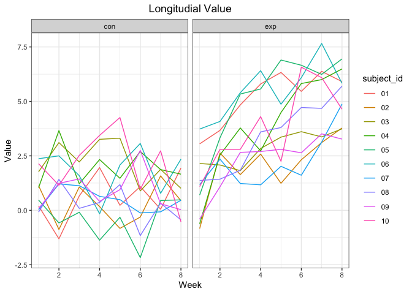
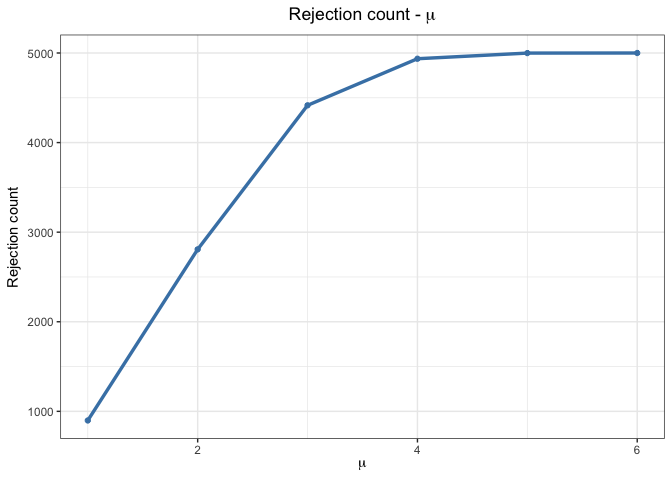
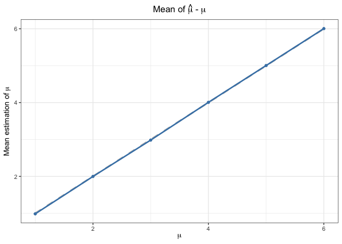
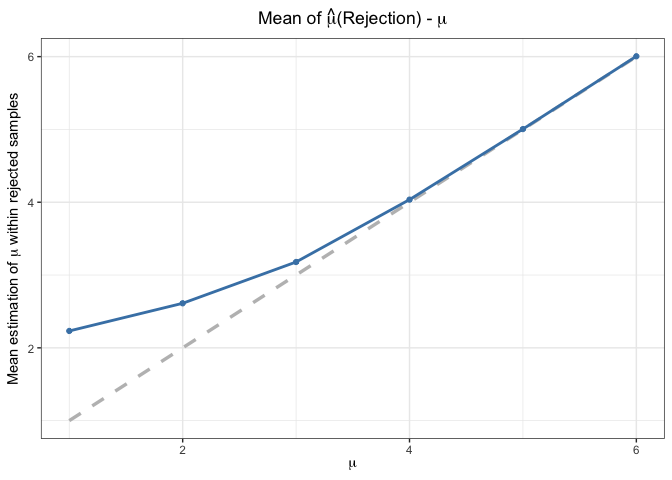

HW5
================
2023-11-04

``` r
library(tidyverse)
library(latex2exp)
```

## Problem 1

### Data Import

Describe the raw data.

``` r
homicide = read_csv("./datasets/homicide-data.csv") 
```

There are 52179 rows and 12 columns in the dataset.

**Variables**:

- `uid`: unique identifier

- `reported_date`: date of homicide accident

- `victim_last`: last name of victim

- `victim_first`: first name of victim

- `victim_race`: race name of victim

- `victim_age`: age name of victim

- `victim_sex`: sex name of victim

- `city`: city location of homicide accident

- `state`: state location of homicide accident

- `lat`: latitude location of homicide accident

- `lon`: longitude location of homicide accident

- `disposition`: disposition outcome of homicide accident

### Data Manipulation

``` r
homicide = homicide|>
        mutate(city_state = str_c(city, state, sep = ', '))
```

``` r
homicide |> 
        group_by(city) |>
        summarise(count = n()) |>
        knitr::kable(caption = "Total number of homicides")
```

| city           | count |
|:---------------|------:|
| Albuquerque    |   378 |
| Atlanta        |   973 |
| Baltimore      |  2827 |
| Baton Rouge    |   424 |
| Birmingham     |   800 |
| Boston         |   614 |
| Buffalo        |   521 |
| Charlotte      |   687 |
| Chicago        |  5535 |
| Cincinnati     |   694 |
| Columbus       |  1084 |
| Dallas         |  1567 |
| Denver         |   312 |
| Detroit        |  2519 |
| Durham         |   276 |
| Fort Worth     |   549 |
| Fresno         |   487 |
| Houston        |  2942 |
| Indianapolis   |  1322 |
| Jacksonville   |  1168 |
| Kansas City    |  1190 |
| Las Vegas      |  1381 |
| Long Beach     |   378 |
| Los Angeles    |  2257 |
| Louisville     |   576 |
| Memphis        |  1514 |
| Miami          |   744 |
| Milwaukee      |  1115 |
| Minneapolis    |   366 |
| Nashville      |   767 |
| New Orleans    |  1434 |
| New York       |   627 |
| Oakland        |   947 |
| Oklahoma City  |   672 |
| Omaha          |   409 |
| Philadelphia   |  3037 |
| Phoenix        |   914 |
| Pittsburgh     |   631 |
| Richmond       |   429 |
| Sacramento     |   376 |
| San Antonio    |   833 |
| San Bernardino |   275 |
| San Diego      |   461 |
| San Francisco  |   663 |
| Savannah       |   246 |
| St. Louis      |  1677 |
| Stockton       |   444 |
| Tampa          |   208 |
| Tulsa          |   584 |
| Washington     |  1345 |

Total number of homicides

``` r
unsolved_label = c("Closed without arrest", "Open/No arrest")
homicide |>
        filter(disposition %in% unsolved_label) |>
        group_by(city) |>
        summarise(unsolved_count = n()) |>
        knitr::kable(caption = "Total number of unsolved homicides")
```

| city           | unsolved_count |
|:---------------|---------------:|
| Albuquerque    |            146 |
| Atlanta        |            373 |
| Baltimore      |           1825 |
| Baton Rouge    |            196 |
| Birmingham     |            347 |
| Boston         |            310 |
| Buffalo        |            319 |
| Charlotte      |            206 |
| Chicago        |           4073 |
| Cincinnati     |            309 |
| Columbus       |            575 |
| Dallas         |            754 |
| Denver         |            169 |
| Detroit        |           1482 |
| Durham         |            101 |
| Fort Worth     |            255 |
| Fresno         |            169 |
| Houston        |           1493 |
| Indianapolis   |            594 |
| Jacksonville   |            597 |
| Kansas City    |            486 |
| Las Vegas      |            572 |
| Long Beach     |            156 |
| Los Angeles    |           1106 |
| Louisville     |            261 |
| Memphis        |            483 |
| Miami          |            450 |
| Milwaukee      |            403 |
| Minneapolis    |            187 |
| Nashville      |            278 |
| New Orleans    |            930 |
| New York       |            243 |
| Oakland        |            508 |
| Oklahoma City  |            326 |
| Omaha          |            169 |
| Philadelphia   |           1360 |
| Phoenix        |            504 |
| Pittsburgh     |            337 |
| Richmond       |            113 |
| Sacramento     |            139 |
| San Antonio    |            357 |
| San Bernardino |            170 |
| San Diego      |            175 |
| San Francisco  |            336 |
| Savannah       |            115 |
| St. Louis      |            905 |
| Stockton       |            266 |
| Tampa          |             95 |
| Tulsa          |            193 |
| Washington     |            589 |

Total number of unsolved homicides

### Proportion Testing

``` r
baltimore = homicide |> 
        filter(city == "Baltimore") |>
        mutate(unsolved = if_else(disposition %in% unsolved_label, 1, 0))
prop_test_obj = prop.test(sum(baltimore$unsolved), nrow(baltimore))
prop_test_df = broom::tidy(prop_test_obj)
```

Estimated Proportion: 0.6455607

Confidence Interval: (0.6275625, 0.6631599)

``` r
tidy = function(city_name, df){
        city_data = df |> 
                filter(city == city_name) |> 
                mutate(unsolved = if_else(disposition %in% unsolved_label, 1, 0))
        prop_test_obj = prop.test(sum(city_data$unsolved), nrow(city_data))
        prop_test_df = broom::tidy(prop_test_obj)
        
        tibble(
                estimate_prop = prop_test_df$estimate,
                conf_low = prop_test_df$conf.low,
                conf_high = prop_test_df$conf.high
        )
}
```

``` r
cities = homicide$city |> unique()
test_result = tibble(
        city = cities,
        hypo_test = map(cities, tidy, df = homicide)
        ) |> 
        unnest(hypo_test)
test_result |> knitr::kable(caption = "Estimated proportion and CI of unsolved homicides")
```

| city           | estimate_prop |  conf_low | conf_high |
|:---------------|--------------:|----------:|----------:|
| Albuquerque    |     0.3862434 | 0.3372604 | 0.4375766 |
| Atlanta        |     0.3833505 | 0.3528119 | 0.4148219 |
| Baltimore      |     0.6455607 | 0.6275625 | 0.6631599 |
| Baton Rouge    |     0.4622642 | 0.4141987 | 0.5110240 |
| Birmingham     |     0.4337500 | 0.3991889 | 0.4689557 |
| Boston         |     0.5048860 | 0.4646219 | 0.5450881 |
| Buffalo        |     0.6122841 | 0.5687990 | 0.6540879 |
| Charlotte      |     0.2998544 | 0.2660820 | 0.3358999 |
| Chicago        |     0.7358627 | 0.7239959 | 0.7473998 |
| Cincinnati     |     0.4452450 | 0.4079606 | 0.4831439 |
| Columbus       |     0.5304428 | 0.5002167 | 0.5604506 |
| Dallas         |     0.4811742 | 0.4561942 | 0.5062475 |
| Denver         |     0.5416667 | 0.4846098 | 0.5976807 |
| Detroit        |     0.5883287 | 0.5687903 | 0.6075953 |
| Durham         |     0.3659420 | 0.3095874 | 0.4260936 |
| Fort Worth     |     0.4644809 | 0.4222542 | 0.5072119 |
| Fresno         |     0.3470226 | 0.3051013 | 0.3913963 |
| Houston        |     0.5074779 | 0.4892447 | 0.5256914 |
| Indianapolis   |     0.4493192 | 0.4223156 | 0.4766207 |
| Jacksonville   |     0.5111301 | 0.4820460 | 0.5401402 |
| Kansas City    |     0.4084034 | 0.3803996 | 0.4370054 |
| Las Vegas      |     0.4141926 | 0.3881284 | 0.4407395 |
| Long Beach     |     0.4126984 | 0.3629026 | 0.4642973 |
| Los Angeles    |     0.4900310 | 0.4692208 | 0.5108754 |
| Louisville     |     0.4531250 | 0.4120609 | 0.4948235 |
| Memphis        |     0.3190225 | 0.2957047 | 0.3432691 |
| Miami          |     0.6048387 | 0.5685783 | 0.6400015 |
| Milwaukee      |     0.3614350 | 0.3333172 | 0.3905194 |
| Minneapolis    |     0.5109290 | 0.4585150 | 0.5631099 |
| Nashville      |     0.3624511 | 0.3285592 | 0.3977401 |
| New Orleans    |     0.6485356 | 0.6231048 | 0.6731615 |
| New York       |     0.3875598 | 0.3494421 | 0.4270755 |
| Oakland        |     0.5364308 | 0.5040588 | 0.5685037 |
| Oklahoma City  |     0.4851190 | 0.4467861 | 0.5236245 |
| Omaha          |     0.4132029 | 0.3653146 | 0.4627477 |
| Philadelphia   |     0.4478103 | 0.4300380 | 0.4657157 |
| Phoenix        |     0.5514223 | 0.5184825 | 0.5839244 |
| Pittsburgh     |     0.5340729 | 0.4942706 | 0.5734545 |
| Richmond       |     0.2634033 | 0.2228571 | 0.3082658 |
| San Antonio    |     0.4285714 | 0.3947772 | 0.4630331 |
| Sacramento     |     0.3696809 | 0.3211559 | 0.4209131 |
| Savannah       |     0.4674797 | 0.4041252 | 0.5318665 |
| San Bernardino |     0.6181818 | 0.5576628 | 0.6753422 |
| San Diego      |     0.3796095 | 0.3354259 | 0.4258315 |
| San Francisco  |     0.5067873 | 0.4680516 | 0.5454433 |
| St. Louis      |     0.5396541 | 0.5154369 | 0.5636879 |
| Stockton       |     0.5990991 | 0.5517145 | 0.6447418 |
| Tampa          |     0.4567308 | 0.3881009 | 0.5269851 |
| Tulsa          |     0.3304795 | 0.2927201 | 0.3705039 |
| Washington     |     0.4379182 | 0.4112495 | 0.4649455 |

Estimated proportion and CI of unsolved homicides

### Plot

``` r
test_result |>
        mutate(city = fct_reorder(city, estimate_prop)) |>
        ggplot(aes(x = city, y = estimate_prop, color = city), width = 100) +
        geom_point() +
        geom_errorbar(aes(ymin = conf_low, ymax = conf_high)) +
        theme_bw() +
        labs(x = "", y = "Estimated proportion", title = "Unsolved homicide proportion") +
        theme(plot.title = element_text(hjust = 0.5), axis.title.x=element_blank(), axis.text.x=element_blank(), axis.ticks.x=element_blank())
```

<!-- -->

## Problem 2

### Data Import

``` r
pth = "./datasets/data/"

data_files = tibble(
        filename = list.files(pth)
)

extract_info = function(filename, pth){
        tibble(
                read_csv(str_c(pth, filename))
        )
}

longitudial_data = data_files |>
        mutate(
                subject_id = str_extract(filename, pattern = "\\d+"),
                arm = str_extract(filename, pattern = "^[a-zA-Z]+"),
                data = map(filename, extract_info, pth)
        ) |> 
        unnest(data)
```

### Plot

``` r
longitudial_data |> 
        pivot_longer(starts_with("week_"), names_prefix = "week_", names_to = "week") |>
        mutate(week = as.numeric(week)) |>
        ggplot(aes(x = week, y = value, color = subject_id)) +
        geom_path() +
        theme_bw() +
        labs(x = "Week", y = "Value", title = "Longitudial Value") +
        theme(plot.title = element_text(hjust = 0.5)) + 
        facet_grid(. ~ arm)
```

<!-- -->

The values of `con` group are fluctuating in specific range while that
of `exp` group are with significant increasing trend along with the
time.

## Problem 3

When designing an experiment or analysis, a common question is whether
it is likely that a true effect will be detected – put differently,
whether a false null hypothesis will be rejected. The probability that a
false null hypothesis is rejected is referred to as power, and it
depends on several factors, including: the sample size; the effect size;
and the error variance.

### Dataset Generation

``` r
trail_count = 5000
exp_data = tibble(
        mu = 1:6
) |> 
        mutate(data = map(mu, function(k){
                tibble(
                        serial = 1:trail_count,
                        hypo_test = map(1:trail_count, function(i, mu = k){
                                data = rnorm(n = 30, mean = mu, sd = 5)
                                test_obj = t.test(data)
                                broom::tidy(test_obj)
                        })
                )
                
                })
               ) |>
        unnest(data) |> 
        unnest(hypo_test)
```

### Plots

1.  Make a plot showing the proportion of times the null was rejected
    (the power of the test) on the y axis and the true value of $\mu$ on
    the x axis. Describe the association between effect size and power.

``` r
exp_data |>
        filter(p.value < 0.05) |>
        group_by(mu) |>
        summarise(count = n(), rej_count= n()) |>
        ggplot(aes(x = mu, y = rej_count)) +
        geom_point(color = "steelblue") + 
        geom_path(color = "steelblue", linewidth = 1.2) +
        theme_bw() +
        labs(x = TeX("$\\mu$"), y = TeX("Rejection count"), title = TeX("Rejection count - $\\mu$")) +
        theme(plot.title = element_text(hjust = 0.5))
```

<!-- -->

Association between effect size and power:

In the figure, the larger $\mu$ leads to the higher rejection count,
which equals to the higher power. So the larger the effect size, the
higher the power.

2.  Make a plot showing the average estimate of $\hat{\mu}$ on the y
    axis and the true value of $\mu$ on the x axis.

``` r
exp_data |>
        group_by(mu) |>
        summarise(mean_estimation = mean(estimate)) |>
        ggplot(aes(x = mu)) +
        geom_line(aes(y = mu), lty = "dashed", color = "grey", linewidth = 1.2) +
        geom_point(aes(y = mean_estimation), color = "steelblue") +
        geom_path(aes(y = mean_estimation), color = "steelblue", linewidth = 1) +
        theme_bw() +
        labs(x = TeX("$\\mu$"), y = TeX("Mean estimation of $\\mu$"), title = TeX("Mean of $\\hat{\\mu}$ - $\\mu$")) +
        theme(plot.title = element_text(hjust = 0.5))
```

<!-- -->

3.  Make a second plot (or overlay on the first) the average estimate of
    $\hat{\mu}$ only in samples for which the null was rejected on the y
    axis and the true value of $\mu$ on the x axis.

``` r
exp_data |>
        filter(p.value < 0.05) |>
        group_by(mu) |>
        summarise(estimate_mean_rej = mean(estimate)) |>
        ggplot(aes(x = mu)) +
        geom_line(aes(y = mu), lty = "dashed", color = "grey", linewidth = 1.2) +
        geom_point(aes(y = estimate_mean_rej), color = "steelblue") +
        geom_path(aes(y = estimate_mean_rej), color = "steelblue", linewidth = 1) + 
        theme_bw() +
        labs(x = TeX("$\\mu$"), y = TeX("Mean estimation of $\\mu$ within rejected samples"), title = TeX("Mean of $\\hat{\\mu}$(Rejection) - $\\mu$")) +
        theme(plot.title = element_text(hjust = 0.5))
```

<!-- -->

The sample average of $\hat{\mu}$ across tests for which the null is
rejected gradually equal to the true value of $\mu$ along with the
increasing of $\mu$.

**Reason**: The samples with extremely large $\hat{\mu}$ than $\mu$ tend
to be rejected for the null hypothesis when the $\mu$ is relatively
small, so the mean of $\hat{\mu}$ is larger than $\mu$. When the $\mu$
becomes greater, the samples with $\hat{\mu}$ fluctuating around $\mu$
will get rejected result for null hypothesis, so the mean of $\hat{\mu}$
is asymptotic to the $\mu$.
